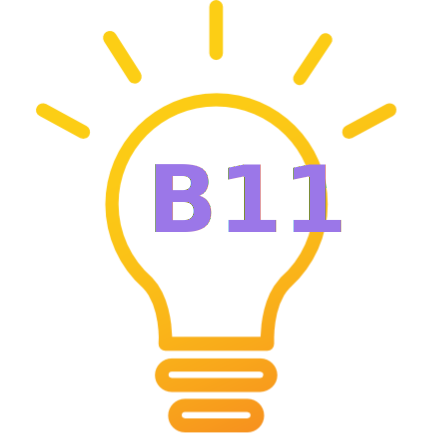

# Bri11iant
[](https://github.com/InclusiveTechNU/Bri11iant/blob/master/LICENSE)
[](https://hci.northwestern.edu/)
[](https://www.nsf.gov/awardsearch/showAward?AWD_ID=1901456)



**Made with :purple_heart: in Evanston, IL at the [Northwestern Inclusive Technology Lab](http://inclusive.northwestern.edu/)**

*Authors: Cooper F. Barth, Thomas B. McHugh, & Anne Marie Piper*

Bri11iant is a [VSCode language extension](https://code.visualstudio.com/api/language-extensions/overview) for supporting web developers improve the accessibility of their websites. Bri11iant fits right into your text editor, suggesting improvements to your HTML, CSS, and Javascript code in order to improve the accessibility of your websites.

We love the web. The goal of Bri11iant is to help make the internet a more inclusive place by providing developers with in-editor support for vital accessibility standards and inclusive design principles. It's often hard to tell what is and isn't an accessibility problem just from looking at your code, and it's even harder sometimes to understand *why* these issues may be harmful. Moreover, there are many ways to make the design of a website more inclusive past simply following WCAG standards. That's where Bri11iant comes in. As you're writing HTML (more languages coming soon!), Bri11iant can diagnose and report parts of your website that could be modified in order to provide your users a more inclusive experience.

Bri11iant is smart. Instead of just parsing the HTML file you're working on, Bri11iant can use the links to your CSS and Javascript files to construct a *virtual render tree* of your website and provide a more complex analysis without you ever needing to launch your browser. This lets Bri11iant give suggestions about inclusive design principles like color contrast, dynamic content handling, and multi-modal content presentation. We want this website to be able to act as a comprehensive resource for learning about accessibility and inclusive design. Alongside the Bri11iant extension, we provide extensive documentation, articles, and blog posts about accessibility, inclusive design, and the A11y community.

## Compatibility

### Text Editors

- [Visual Studio Code](https://code.visualstudio.com)
- More on the way!

### Languages

- HTML / CSS
- [React.js](https://reactjs.org) (Coming Soon)
- [React Native](https://facebook.github.io/react-native/) (Coming Soon)
- [Vue.js](https://vuejs.org) (Coming Soon)

## Run

### Visual Studio Code

1. Download the Bri11iant extension within the VSCode application.
2. Install and enable the application

### Local (VSCode)

First, clone the repository:

```unix
git clone https://github.com/InclusiveTechNU/Bri11iant.git
cd Bri11iant
```

Then, run these commands to install dependencies and compile the project:

```unix
npm install
npm start
```

Open Visual Studio Code. Press ⌘ + Shift + B to build the project. Then, press F5 to run the project in debug mode. A new VSCode window should pop up with the language client and server running.

This project is built and maintained by the [Northwestern University Inclusive Technology Lab](https://inclusive.northwestern.edu) and is funded by [NSF Grant 1901456](https://www.nsf.gov/awardsearch/showAward?AWD_ID=1901456).
